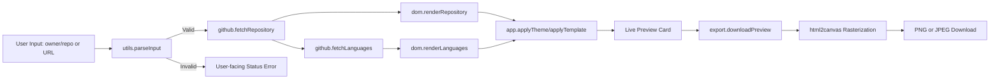

[](https://github.com/readme-SVG/readme-SVG-typing-generator)

[](https://github.com/OstinUA)

Create production-ready `1280×640` Open Graph preview images from public GitHub repositories directly in the browser, with zero build tooling and deterministic export behavior.

[](LICENSE)
[](./.github/workflows/sast.yml)
[](./.github/workflows/lint.yml)
[](./.github/workflows/scorecard.yml)
[](server.py)

> [!NOTE]
> This repository is a static front-end application with a minimal Python server for local development only.

[](https://github.com/readme-SVG/github-social-preview-generator/blob/main/Examples/EXAMPLES.md)

<details>
  <summary>Examples of Generated Previews <strong>← Open</strong></summary>
  <br>

[](https://github.com/readme-SVG/github-social-preview-generator/blob/main/Examples/EXAMPLES.md)

[](https://github.com/OstinUA)

[](https://github.com/readme-SVG/github-social-preview-generator/blob/main/Examples/EXAMPLES.md)

[](https://github.com/OstinUA)

[](https://github.com/readme-SVG/github-social-preview-generator/blob/main/Examples/EXAMPLES.md)

[](https://github.com/OstinUA)

[](https://github.com/readme-SVG/github-social-preview-generator/blob/main/Examples/EXAMPLES.md)

[](https://github.com/OstinUA)

[](https://github.com/readme-SVG/github-social-preview-generator/blob/main/Examples/EXAMPLES.md)

[](https://github.com/OstinUA)

[](https://github.com/readme-SVG/github-social-preview-generator/blob/main/Examples/EXAMPLES.md)

[](https://github.com/OstinUA)

[](https://github.com/readme-SVG/github-social-preview-generator/blob/main/Examples/EXAMPLES.md)

[](https://github.com/OstinUA)

</details>

## Table of Contents

- [Features](#features)
- [Tech Stack & Architecture](#tech-stack--architecture)
  - [Core Stack](#core-stack)
  - [Project Structure](#project-structure)
  - [Key Design Decisions](#key-design-decisions)
- [Getting Started](#getting-started)
  - [Prerequisites](#prerequisites)
  - [Installation](#installation)
- [Testing](#testing)
- [Deployment](#deployment)
- [Usage](#usage)
- [Configuration](#configuration)
- [License](#license)
- [Support the Project](#support-the-project)

## Features

- Client-side generation of GitHub social preview assets at fixed `1280×640` dimensions.
- Flexible repository input parser supporting both:
  - Full URL format (for example, `https://github.com/owner/repo`)
  - Shorthand format (`owner/repo`)
- Real-time metadata retrieval from the GitHub REST API, including:
  - Repository name, owner, and description
  - Default branch, creation year, and last update timestamp
  - License metadata and repository size
- Language composition visualization using repository language byte statistics.
- Multiple visual themes and templates for post-branding consistency:
  - Themes: blue, green, purple, orange, red, cyan
  - Layouts: `grid`, `timeline`, `spotlight`, `minimal`, `compact`
- High-quality export pipeline with both `PNG` and `JPEG` output modes.
- Sanitized, deterministic filenames for generated assets.
- Graceful fallback behavior when optional API calls fail (for example, language endpoint degradation).
- Browser-native runtime with no mandatory backend service for production hosting.
- Security and quality automation integrated through GitHub Actions (linting, static analysis, scorecard).

> [!TIP]
> This project is ideal for release announcements, changelog promotion, repository showcases, and portfolio posts where visual consistency matters.

## Tech Stack & Architecture

### Core Stack

- **HTML5** for semantic structure and rendering surface.
- **CSS3** for component styling, theme tokens, and card composition.
- **Vanilla JavaScript (ES Modules)** for modular app logic and DOM orchestration.
- **Python 3** for local static file serving (`server.py`).
- **GitHub REST API** (`/repos/{owner}/{repo}` and languages endpoints) for metadata hydration.
- **`html2canvas`** (loaded from CDN) for DOM-to-image rasterization.

### Project Structure

```text
.
├── index.html
├── server.py
├── LICENSE
├── CONTRIBUTING.md
├── README.md
├── assets
│   ├── css
│   │   └── styles.css
│   ├── js
│   │   ├── app.js
│   │   ├── constants.js
│   │   ├── dom.js
│   │   ├── export.js
│   │   ├── github.js
│   │   └── utils.js
│   └── vendor
│       └── gif.js
├── Image
├── trigger action
│   └── trigger_action.py
└── .github
    ├── FUNDING.yml
    ├── labels.yml
    ├── dependabot.yml
    ├── pull_request_template.md
    ├── ISSUE_TEMPLATE
    │   ├── bug_report.yml
    │   └── feature_request.yml
    └── workflows
        ├── ai-issue.yml
        ├── dependabot-auto-merge.yml
        ├── label-sync.yml
        ├── lint.yml
        ├── sast.yml
        └── scorecard.yml
```

### Key Design Decisions

- **Frontend-first execution model**
  - All core functionality runs in the browser to minimize operational overhead.
  - Deployment remains static-host friendly (GitHub Pages, Netlify, object storage, CDN).
- **Module boundary separation**
  - API access, rendering, exports, constants, and parsing utilities are isolated in dedicated files.
  - This reduces coupling and simplifies targeted maintenance.
- **Deterministic output dimensions**
  - Fixed `1280×640` export dimensions ensure predictable OG-style rendering.
- **Resilient metadata pipeline**
  - Non-critical failures (such as language endpoint issues) do not block primary preview generation.
- **Minimal local tooling requirements**
  - Python’s standard library HTTP server avoids mandatory Node bundlers for contributors.



> [!IMPORTANT]
> Unauthenticated GitHub API calls are rate-limited. For heavy usage, consider adding a proxy service with token-based requests and cache controls.

## Getting Started

### Prerequisites

- `Python >= 3.9` (recommended `3.11+`) for local static hosting.
- A modern browser with ES Module support (Chrome, Edge, Firefox, Safari).
- Internet connectivity for:
  - GitHub API requests
  - External font assets
  - `html2canvas` CDN delivery

### Installation

```bash
git clone https://github.com/<your-org-or-user>/github-social-preview-generator.git
cd github-social-preview-generator
```

Start the local development server:

```bash
python server.py
```

Open the application:

```text
http://127.0.0.1:8000
```

> [!WARNING]
> Loading `index.html` with a `file://` URL can break ES module imports in some browsers. Always use `python server.py` during local development.

## Testing

The repository currently relies on syntax validation and CI automation rather than a dedicated unit-test harness.

Run local checks:

```bash
# Python syntax validation
python -m py_compile server.py "trigger action/trigger_action.py"

# JavaScript syntax checks
node --check assets/js/app.js
node --check assets/js/constants.js
node --check assets/js/dom.js
node --check assets/js/export.js
node --check assets/js/github.js
node --check assets/js/utils.js
```

CI workflows in `.github/workflows/` provide additional quality gates:

- `lint.yml` for lint/static checks
- `sast.yml` for CodeQL static analysis
- `scorecard.yml` for OpenSSF scorecard evaluation

> [!CAUTION]
> Keep CI workflow assumptions synchronized with repository structure to avoid false negatives when directories evolve.

## Deployment

### Static Deployment Targets

Deploy `index.html` and the `assets/` directory to any static host:

- GitHub Pages
- Netlify
- Vercel (static mode)
- S3 + CloudFront
- NGINX or Apache static site hosting

### Production Deployment Guidance

- Configure caching for static files (`assets/*`) with immutable cache headers where possible.
- Consider API proxying if you need:
  - Higher request limits
  - Authenticated API access
  - Centralized observability and request telemetry
- Pin third-party runtime dependencies and external assets to stable versions.
- Apply CSP headers compatible with required GitHub API and CDN/font origins.

### CI/CD Integration

This repository includes GitHub Actions workflows for:

- Security analysis (`CodeQL`, `OpenSSF Scorecard`)
- Lint and static checks
- Repository automation (labels, dependency management, issue automation)

## Usage

### 1) Interactive UI Flow

1. Open the app in your browser.
2. Enter either `owner/repo` or a full GitHub repository URL.
3. Click the generate action to fetch metadata.
4. Choose a theme and layout template.
5. Export as `PNG` or `JPEG`.

### 2) Programmatic Data Fetch Flow

```js
import { parseInput } from './assets/js/utils.js';
import { fetchRepository, fetchLanguages } from './assets/js/github.js';

async function buildPreviewModel(input) {
  // Parse and normalize input into owner/repo pair.
  const parsed = parseInput(input);
  if (!parsed) throw new Error('Invalid repository reference');

  // Fetch primary repository metadata.
  const repository = await fetchRepository(parsed.owner, parsed.repo);

  // Fetch and rank repository languages by byte count.
  const languages = await fetchLanguages(repository.languages_url);

  // Return model used by the rendering layer.
  return {
    fullName: `${repository.owner.login}/${repository.name}`,
    description: repository.description ?? 'No description provided.',
    defaultBranch: repository.default_branch,
    topLanguages: languages.map(([name]) => name),
  };
}
```

### 3) Export Preview Programmatically

```js
import { downloadPreview } from './assets/js/export.js';

downloadPreview({
  type: 'png', // or 'jpeg'
  button: document.getElementById('btn-png'),
  captureElement: document.getElementById('capture'),
  repoDisplayElement: document.getElementById('o-repo-display'),
});
```

## Configuration

### Runtime Constants

Primary constants are declared in `assets/js/constants.js`:

- `GITHUB_API_BASE_URL`: Base repository API URL.
- `DEFAULT_THEME`: Startup theme key.
- `THEMES`: Theme palette/token mapping.
- `LANG_COLORS`: Language badge color mapping.

### Local Server Settings

`server.py` uses configurable constants:

- `HOST` (default `127.0.0.1`)
- `PORT` (default `8000`)

Edit these values directly to match your local environment.

### Environment Variables for Automation Scripts

The automation script `trigger action/trigger_action.py` expects the following environment variables in CI contexts:

- `GITHUB_TOKEN`
- `GH_MODELS_TOKEN`
- `REPOSITORY`
- `EVENT_NAME`
- `COMMIT_SHA`
- `PR_NUMBER`
- `ALLOWED_USER`

Example `.env` template for CI-like local runs:

```dotenv
GITHUB_TOKEN=ghp_xxx
GH_MODELS_TOKEN=ghm_xxx
REPOSITORY=owner/repo
EVENT_NAME=pull_request
COMMIT_SHA=<sha>
PR_NUMBER=1
ALLOWED_USER=<github-username>
```

> [!NOTE]
> The front-end application itself does not require a `.env` file for normal local usage.

## License

This project is licensed under the **MIT License**. See [`LICENSE`](./LICENSE) for full terms.

## Support the Project

[](https://www.patreon.com/OstinFCT)
[](https://ko-fi.com/fctostin)
[](https://boosty.to/ostinfct)
[](https://www.youtube.com/@FCT-Ostin)
[](https://t.me/FCTostin)

If you find this tool useful, consider leaving a star on GitHub or supporting the author directly.
