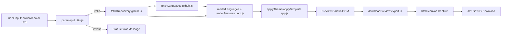

# GitHub Social Preview Generator

A lightweight, client-side web tool that generates polished `1280×640` GitHub social preview images directly from repository metadata.

[](LICENSE)
[](./.github/workflows/sast.yml)
[](./.github/workflows/lint.yml)
[](./.github/workflows/scorecard.yml)

> [!NOTE]
> This project is a static front-end application with a tiny Python dev server for local hosting convenience.

## Table of Contents

- [Features](#features)
- [Tech Stack & Architecture](#tech-stack--architecture)
- [Getting Started](#getting-started)
- [Testing](#testing)
- [Deployment](#deployment)
- [Usage](#usage)
- [Configuration](#configuration)
- [License](#license)
- [Support the Project](#support-the-project)

## Features

- Generate social preview cards for any public GitHub repository using either:
  - Full URLs (for example, `https://github.com/owner/repo`)
  - Short form identifiers (for example, `owner/repo`)
- Live retrieval of repository metadata from the GitHub REST API:
  - Name, description, owner, default branch
  - Last update date and creation year
  - License and repository size
  - Language composition (top languages)
- Multiple visual themes (blue, green, purple, orange, red, cyan).
- Multiple layout templates (`grid`, `timeline`, `spotlight`, `minimal`, `compact`).
- Export support for both `JPEG` and `PNG` image formats.
- Deterministic export canvas size set for social media rendering: `1280 × 640`.
- Friendly status and loading states for asynchronous fetch/export actions.
- Sanitized filenames for generated assets.
- Browser-first architecture with no mandatory backend for production use.

> [!TIP]
> The tool is ideal for repository launch posts, changelog announcements, and portfolio showcases where consistent visual branding matters.

## Tech Stack & Architecture

### Core Technologies

- **HTML5** for structure and semantic layout.
- **CSS3** (custom styling and responsive card composition).
- **Vanilla JavaScript (ES Modules)** for application logic and DOM orchestration.
- **Python 3** (`http.server`) for local static hosting.
- **`html2canvas`** (CDN) for in-browser rasterization and image export.
- **GitHub REST API** for repository and language metadata retrieval.

### Project Structure

```text
.
├── index.html
├── server.py
├── LICENSE
├── assets
│   ├── css
│   │   └── styles.css
│   └── js
│       ├── app.js
│       ├── constants.js
│       ├── dom.js
│       ├── export.js
│       ├── github.js
│       └── utils.js
├── trigger action
│   └── trigger_action.py
└── .github
    ├── FUNDING.yml
    ├── labels.yml
    ├── dependabot.yml
    ├── pull_request_template.md
    ├── ISSUE_TEMPLATE
    │   ├── bug_report.yml
    │   └── feature_request.yml
    └── workflows
        ├── ai-issue.yml
        ├── dependabot-auto-merge.yml
        ├── label-sync.yml
        ├── lint.yml
        ├── sast.yml
        └── scorecard.yml
```

### Key Design Decisions

- **Client-side rendering first:** The app avoids backend rendering to reduce operational complexity and improve portability.
- **Modular JavaScript boundaries:** API access, DOM rendering, exports, constants, and utility helpers are isolated by module.
- **Graceful API degradation:** Language fetch failures do not break card generation and fallback UI remains functional.
- **Preset output dimensions:** Fixed image geometry ensures compatibility with GitHub/Open Graph style preview requirements.
- **Simple local runtime:** Python-based static serving avoids opinionated JS tooling requirements for contributors.



> [!IMPORTANT]
> The application currently consumes unauthenticated GitHub API endpoints. Heavy usage may hit rate limits in browser sessions.

## Getting Started

### Prerequisites

- `Python 3.9+` (recommended: `3.11+`) for local static server execution.
- A modern browser with ES module support (Chrome, Edge, Firefox, Safari).
- Internet access for:
  - GitHub API requests
  - Google Fonts and `html2canvas` CDN dependency

### Installation

```bash
git clone https://github.com/<your-org-or-user>/github-social-preview-generator.git
cd github-social-preview-generator
```

Start the local server:

```bash
python server.py
```

Open in your browser:

```text
http://127.0.0.1:8000
```

> [!WARNING]
> Opening `index.html` directly as a `file://` URL may break module loading in some browsers. Use `python server.py` instead.

## Testing

This repository does not currently include a dedicated unit-test framework, but you can run static and syntax validation checks.

### Local Validation Commands

```bash
# Python syntax check
python -m py_compile server.py "trigger action/trigger_action.py"

# JavaScript syntax checks for browser modules
node --check assets/js/app.js
node --check assets/js/constants.js
node --check assets/js/dom.js
node --check assets/js/export.js
node --check assets/js/github.js
node --check assets/js/utils.js
```

### CI-Based Checks

- **Lint and static checks** via `.github/workflows/lint.yml`.
- **CodeQL SAST** via `.github/workflows/sast.yml`.
- **OpenSSF Scorecard** via `.github/workflows/scorecard.yml`.

> [!CAUTION]
> The current lint workflow checks an `api/` directory if present. Since this project is front-end-centric, ensure CI validation scripts remain aligned with repository structure as it evolves.

## Deployment

### Static Deployment (Recommended)

This project can be deployed as static assets to any web host:

- GitHub Pages
- Netlify
- Vercel (static mode)
- NGINX/Apache static hosting
- S3 + CloudFront

Suggested deployment artifact set:

- `index.html`
- `assets/`

### Production Hardening Considerations

- Optionally proxy GitHub API calls through a lightweight backend if you need:
  - Higher request quotas with authenticated tokens
  - Response caching
  - Better observability and analytics
- Pin external dependencies where possible:
  - `html2canvas` version
  - Google Font families and weights
- Add CSP headers compatible with CDN/font hosts in your target environment.

### CI/CD Integration

The repository already contains multiple GitHub Actions workflows for:

- Static/security checks
- Label automation and dependency maintenance
- AI-assisted issue generation in selected event contexts

## Usage

1. Launch the app and paste a GitHub repository URL or `owner/repo`.
2. Click `Generate`.
3. Select a theme and template variant.
4. Export as `JPEG` or `PNG`.

### Practical Example: Programmatic Core Flow

```js
import { parseInput } from './assets/js/utils.js';
import { fetchRepository, fetchLanguages } from './assets/js/github.js';

async function generate(ownerRepoOrUrl) {
  // Parse either full URL or owner/repo shorthand.
  const parsed = parseInput(ownerRepoOrUrl);
  if (!parsed) throw new Error('Invalid repository reference');

  // Fetch repository metadata from GitHub REST API.
  const repository = await fetchRepository(parsed.owner, parsed.repo);

  // Fetch and sort languages by byte count.
  const topLanguages = await fetchLanguages(repository.languages_url);

  // Return normalized data for UI rendering.
  return {
    fullName: `${repository.owner.login}/${repository.name}`,
    description: repository.description ?? 'No description provided.',
    languages: topLanguages.map(([name]) => name),
    defaultBranch: repository.default_branch,
  };
}
```

### Practical Example: Download Export

```js
import { downloadPreview } from './assets/js/export.js';

// Trigger JPEG export of the rendered card element.
downloadPreview({
  type: 'jpeg',
  button: document.getElementById('btn-jpg'),
  captureElement: document.getElementById('capture'),
  repoDisplayElement: document.getElementById('o-repo-display'),
});
```

## Configuration

### Runtime Configuration

This project is mostly convention-based and does not require a `.env` file for local UI usage.

#### Front-End Constants

Defined in `assets/js/constants.js`:

- `GITHUB_API_BASE_URL`: Base GitHub API endpoint (`https://api.github.com/repos`).
- `DEFAULT_THEME`: Initial theme key at app startup.
- `THEMES`: Theme token map for gradient and accent colors.
- `LANG_COLORS`: Language-to-color mapping used for footer badges.

#### Startup Flags

- `server.py` currently runs with:
  - host `127.0.0.1`
  - port `8000`
- To customize, edit `HOST` and `PORT` in `server.py`.

### GitHub Actions Environment Variables

The workflow script in `trigger action/trigger_action.py` consumes:

- `GITHUB_TOKEN`
- `GH_MODELS_TOKEN`
- `REPOSITORY`
- `EVENT_NAME`
- `COMMIT_SHA`
- `PR_NUMBER`
- `ALLOWED_USER`

These are required for automated AI analysis and issue/comment automation in CI.

## License

This project is licensed under the **MIT License**. See [`LICENSE`](./LICENSE) for full legal text.

## Support the Project

[](https://www.patreon.com/OstinFCT)
[](https://ko-fi.com/fctostin)
[](https://boosty.to/ostinfct)
[](https://www.youtube.com/@FCT-Ostin)
[](https://t.me/FCTostin)

If you find this tool useful, consider leaving a star on GitHub or supporting the author directly.
