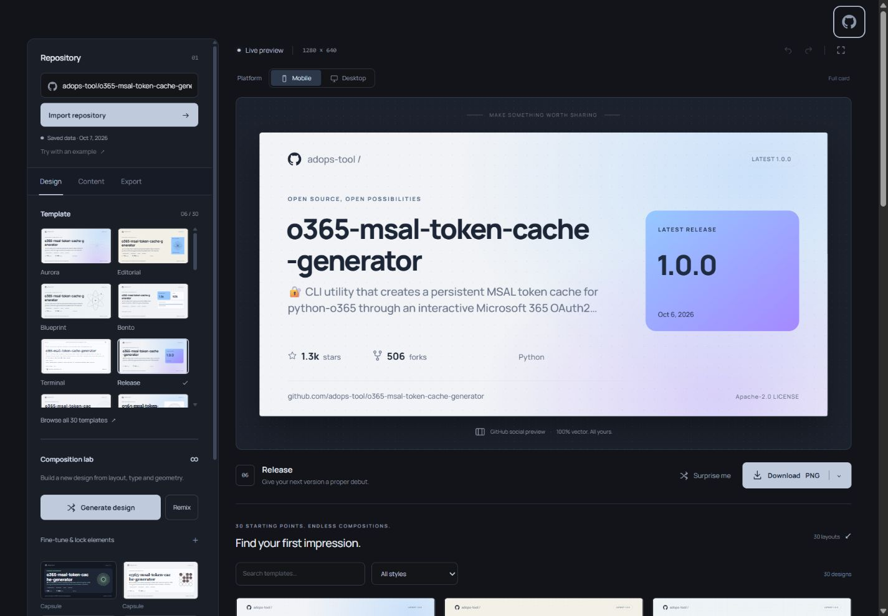

# RepoCard Studio

A GitHub repository card editor with **30 templates**, a procedural composition generator, public repository data, and consistent PNG, JPEG and SVG exports. Rebuilt from GitHub Social Preview Generator.

[See exported examples](Examples/REPOCARD.md).



**Run locally:**

```bash
python server.py
```

Open **http://127.0.0.1:8000**. If the port is busy, use `python server.py --port 8001`.

No bundler, install step, CDN scripts, account or API token is required. Use a local HTTP server rather than opening `index.html` directly. The app can also be deployed as static files under a domain or subdirectory.

## What you can make

| Layout | Best for |
| --- | --- |
| Aurora | An atmospheric project cover with soft gradients and geometric detail |
| Editorial | A restrained, warm typographic cover |
| Blueprint | Technical tools and libraries with an orbital diagram and drafting grid |
| Bento | Repository statistics and a proportional language breakdown |
| Terminal | A developer-focused cover with clone command, stack and repository metadata |
| Release | Release announcements with the actual latest GitHub release tag and date |

The library also includes **Monolith, Obsidian, Signal, Orbit, Noir, Neon, Paper, Swiss, Prism, Circuit, Schematic, Capsule, Horizon, Waveform, Gridline, Gallery, Spectrum, Mosaic, Dossier, Folio, Eclipse, Badge, Chromatic and Stack**. Search the gallery or filter it by style. These use poster, column, framed, split, diagonal, network, mosaic and other compositions, with different typography and geometric artwork.

## Composition lab

**Generate design** builds a new composition from independent choices, rather than selecting a preset. **Remix** keeps the current composition and changes its visual treatment. Four generated previews offer alternative designs to choose from.

Open **Fine-tune & lock elements** to choose a composition, typography, background, decoration, spacing and corner radius. Lock layout, typography, background, decoration or colors to preserve them during generation. A numeric design seed reproduces the generated settings and geometry; saved projects and design links keep it. Generating a design preserves repository data, editable copy, canvas size, platform and the chosen Showcase numbers.

## Mobile and Desktop

The **Platform: Mobile / Desktop** switch is separate from export dimensions. Mobile fills the card. Desktop restores the original full-width composition with 77-pixel safe spaces above and below, compacting the content and reducing type without stretching glyphs. Both modes export the chosen canvas dimensions, including the standard 1280 × 640 GitHub card. Platform is saved in projects, links and undo history.

- Import a public GitHub URL, `owner/repo`, or a repository subpage.
- Repository topics, code languages, license, push date, latest release and a sample of contributors from GitHub.
- **Showcase statistics are enabled by default**: stars are randomized from 1,000–2,000 and forks from 300–700, preserving the original generator’s visual effect. Generate another combination in Content, or switch to **GitHub data** for actual counts. The chosen numbers stay consistent across the preview, gallery, exports, project saves and design links.
- A dark gray-blue interface, seven card palettes including neutral Slate, a custom hex accent, light/dark appearance and background detail toggle.
- Editable title, description, small heading and footer. Long names fit automatically; excess description text is ellipsized. Unicode is supported by the bundled font and system fallback fonts.
- Choose which metadata appears on your card. Different templates arrange it for their purpose.
- GitHub **1280 × 640**, Open Graph **1200 × 630**, or square **1080 × 1080**. Square layouts recompose the content.
- PNG and JPEG at 1× or 2×, plus an editable SVG with an embedded Manrope font.
- Automatic local save, editable JSON projects, design undo/redo, full-screen preview and randomized design combinations.
- Share a design link with the repository reference and design settings. Opening the link imports current GitHub data. JSON projects preserve the original data snapshot.
- Responsive interface with keyboard-accessible controls and reduced-motion support.

The default Astro example is a real, bundled GitHub snapshot from **October 7, 2026**, explicitly labeled in the editor. Import the repository to refresh its data. The example, editor and exports remain usable when GitHub is unavailable.

## Using a card on GitHub

1. Import your repository and customize the card.
2. In **Export**, choose GitHub dimensions, PNG or JPEG, and 1× resolution.
3. Download the image.
4. On GitHub, open the repository’s **Settings → General → Social preview** and upload it.

SVG is intended for further editing and other publishing workflows. It is not a GitHub social-preview upload format.

## Data and privacy

The app reads the public GitHub REST API directly from the browser. There is no app backend, telemetry, sign-in or stored token. Local settings and the current repository snapshot are stored in this browser’s local storage. Export a JSON project to preserve them separately.

GitHub applies [unauthenticated request limits](https://docs.github.com/en/rest/using-the-rest-api/rate-limits-for-the-rest-api). Successful API responses are cached in memory for five minutes. Requests time out after 15 seconds and stale imports are cancelled. Missing language, release or contributor data does not block the card. Errors preserve the current design and explain how to recover.

Language percentages use repository code **bytes**, not file counts. GitHub’s open-issues count includes pull requests. In a monorepo, the latest release may belong to an individual package. Contributor names are a small API sample, not a complete contributor count.

## Architecture

The same SVG renderer generates both the visible preview and exported artwork. Native browser rasterization produces PNG/JPEG; there is no html2canvas dependency or temporary removal of design effects. All fonts and artwork are local or procedural, and exported SVGs have no external asset dependencies.

```text
index.html                  Accessible editor UI
server.py                   Local Python static server
assets/css/styles.css       Responsive interface and local font
assets/js/app.js             Editor state, events, history and persistence
assets/js/constants.js       Palettes, formats and default settings
assets/js/renderer.js        Shared SVG card renderer and text fitting
assets/js/compositions.js    Additional composition families and seeded artwork
assets/js/generator.js       Reproducible generation, remixing and element locks
assets/js/github.js          API requests, normalization and cache
assets/js/state.js           Project validation and Unicode share links
assets/js/export.js          SVG-to-canvas image export and downloads
assets/js/dom.js             Icons and status notifications
assets/js/utils.js           Strict repository parsing and escaping
assets/fonts/               Manrope font and its OFL license
assets/demo-*.json           Dated example repository snapshot
tests/                      Unit tests and browser export verification
```

User text is XML-escaped before rendering. Imported project fields are validated, bounded and allowlisted. Repository URLs must use the actual `github.com` hostname; arbitrary API destinations and lookalike hosts are rejected.

## Verification

Node.js 20+ is only needed for development checks; the app itself has no Node runtime dependency.

```bash
node scripts/check.js
node --test tests/*.test.js
python -m py_compile server.py
```

The same checks are available as `npm run lint` and `npm test` and run in the lint GitHub Actions workflow. No npm dependencies need installing.

For browser verification, serve the project, open **http://127.0.0.1:8000/tests/browser.html**, and click **Run export checks**. Its 70 cases render all 30 templates, compare preview and actual exports, verify decoded dimensions and MIME types, and check text ink bounds for overlaps. They cover generated designs, Desktop safe areas, square format, 2× JPEG, embedded-font SVG, and long Cyrillic text at maximum title size in every generated layout. Downloads are available for each output. Desktop/mobile interface layout and editor interactions should also be reviewed in a browser.

## Hosting

Deploy `index.html` and the complete `assets/` directory to GitHub Pages or another static host. There is no build step. `server.py` is for local development and binds only to `127.0.0.1`. Internet connectivity is needed only for live GitHub imports; local files, existing designs and export work without third-party font or script services.

## Credits and license

Original project: [readme-SVG/github-social-preview-generator](https://github.com/readme-SVG/github-social-preview-generator), by [OstinUA](https://github.com/OstinUA). The original repository license is preserved in [LICENSE](LICENSE). Manrope is included under the [SIL Open Font License](assets/fonts/OFL.txt).

[Support on Ko-fi](https://ko-fi.com/fctostin) · [Patreon](https://www.patreon.com/OstinFCT)
